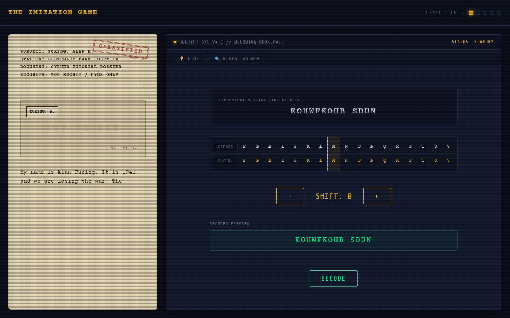
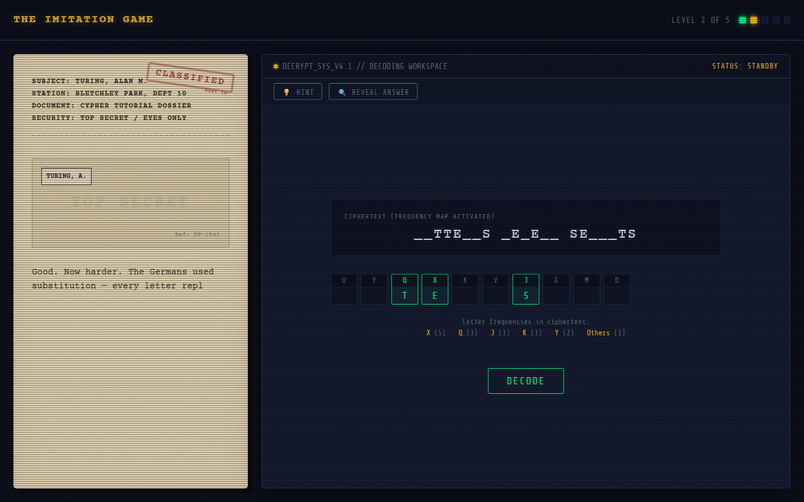
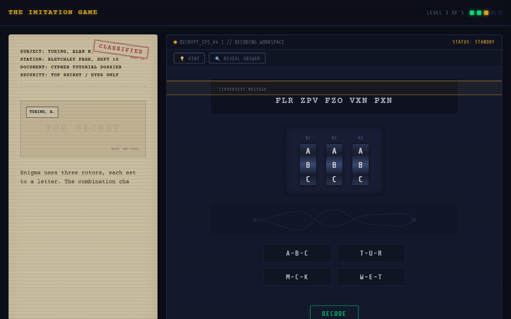
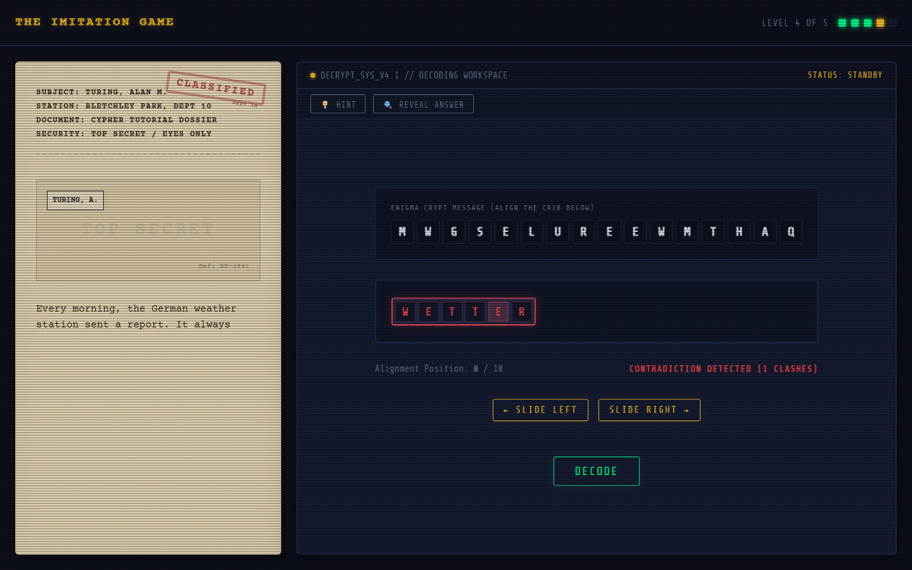

<!-- NOTE: This README is best viewed directly on GitHub for full layout formatting -->

# 🔒 THE IMITATION GAME

> An interactive browser puzzle celebrating Alan Turing — the father of modern computer science. Five levels. Five real techniques that broke Enigma in World War II.

---

## ▶️ PLAY THE GAME

**[PLAY NOW](https://USERNAME.github.io/REPO-NAME/)**

*Note: Replace USERNAME and REPO-NAME after deploying to GitHub Pages.*

---

## 🔑 LEVELS

| Level | Name | Real Technique |
| :--- | :--- | :--- |
| **01** | Caesar Cipher | Shift-based alphabet substitution |
| **02** | Substitution Cipher | Frequency analysis of letter patterns |
| **03** | Enigma Rotors | Logical elimination of rotor settings |
| **04** | Crib Dragging | Known plaintext attack on Enigma output |
| **05** | The Bombe | Electromechanical constraint solving |

---

## 📷 SCREENSHOTS

---

## 🔑 HOW TO PLAY

1. **Caesar Cipher** — Adjust the shift value using the plus and minus buttons until the sliding tape resolves the ciphertext `EOHWFKOHB SDUN` to `BLETCHLEY PARK` (Shift of 3).
2. **Substitution Cipher** — Decrypt the message by mapping ciphertext letters to their correct plaintext equivalents in the substitution key table, utilizing frequency highlights.
3. **Enigma Rotors** — Select the correct rotor configuration combination (`T-U-R`) from the options to light up the lampboard via animated electrical signals.
4. **Crib Dragging** — Slide the known word "WETTER" horizontally across the ciphertext block to the single valid alignment with zero letter clashes (position 6).
5. **The Bombe** — Calibrate the dial letters for the Bombe machine to spell `TURING` by satisfying all six diagnostics telemetry constraints.

---

## 🕯️ ALAN TURING — A TRIBUTE

> Alan Turing (1912–1954) saved an estimated 14 million lives by accelerating the decryption of German Enigma traffic at Bletchley Park. He was never publicly credited. In 1952 he was convicted of gross indecency for being gay and subjected to chemical castration by the British government. He died in 1954, aged 41. In 2013 he received a Royal Pardon. In 2021 his face appeared on the British £50 note. He asked one question above all others: can machines think? We are still finding the answer.

---

## 🔧 TECH STACK

- Pure HTML5, CSS3, Vanilla JavaScript — zero dependencies, zero build step
- Single deployable `index.html` with external `styles.css` and `script.js`
- Deployable on GitHub Pages in under 60 seconds

---

## 🚀 DEPLOY YOUR OWN

1. Fork this repository
2. Go to **Settings > Pages**
3. Set source to **main** branch, **/ (root)** folder
4. Visit `https://USERNAME.github.io/REPO-NAME/`

---

## 🏆 SUBMISSION

Built for the **DEV.to June Solstice Game Jam 2026** in the *Best Ode to Alan Turing* category. **[VIEW SUBMISSION](https://dev.to/placeholder)**

---

  Built with obsession for Alan Turing. June 2026.
   
  DEV.to June Solstice Game Jam — Best Ode to Alan Turing

